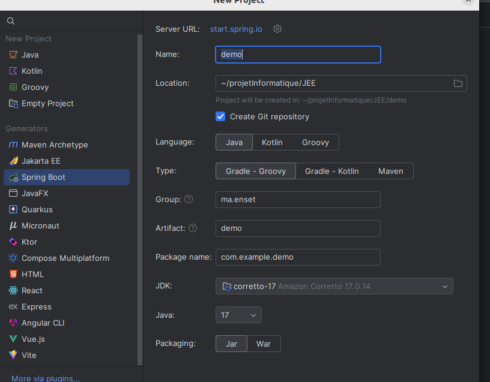
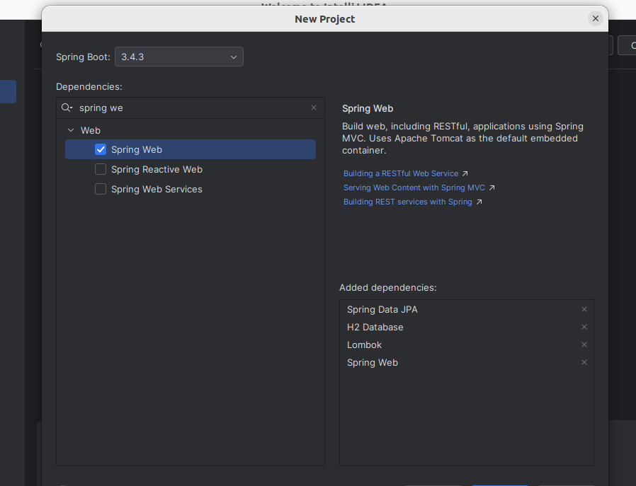

## Application de gestion d' hôpital
Dans cette application nous avons creer une applicatin de  gestion d'hôpital  dans l'objeectif de 
mettre en evidence le concept de mapping objet relationnel en utilisant spring Data 
 JPA (Java Persistence API)   son implementation Hibernate : 

nous creeoons un projet spricng boot avec des dependance  JPA, lombock, h2 et spring web

