## Application de gestion d' hôpital
Dans cette application nous avons creer une applicatin de  gestion d'hôpital  dans l'objeectif de 
mettre en evidence le concept de mapping objet relationnel en utilisant spring Data 
 JPA (Java Persistence API)   son implementation Hibernate : 

nous creeoons un projet spricng boot avec des dependance  JPA, lombock, h2 et spring web


Apres la definition de  l'entite  Patient,  executons  nous faisons les configuration dans la le fichier 
application.propaties pour  tester le projet. Nous avons les resultats suivant a l'execution.
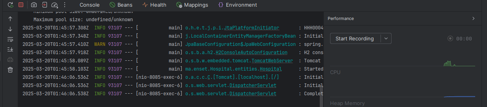

nous pouvons voir la base de donnees h2 qui a ete cree saisissant dans le navigateur http://localhost:8085/h2-console/
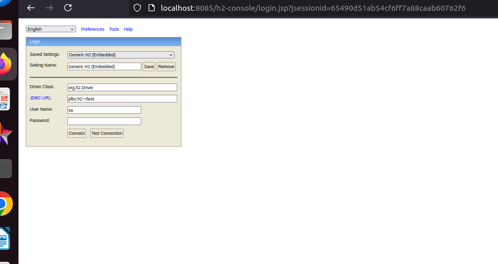
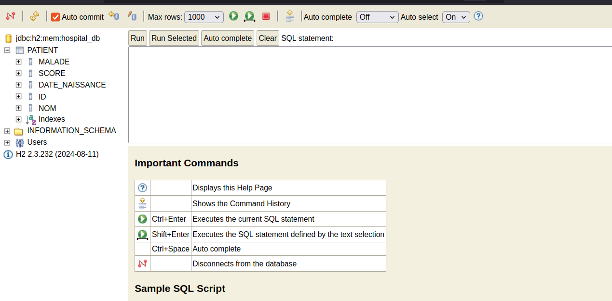


Nous passons a present a la creation de l'intjerface JPA Repository basée sur Spring data. Apres cette creation , nous pouvons maaintenant  implemnter la 
l'interface Commandline run pour redefinir la methode run qui va nous permettre de faire des ajout.
nous definissions de type patientrepository,nous faisons l'injection grace a l'annotation autowired et nous utiisons cet objet pour faire  des savec dans la metode run que nous redefinisson
nou avons les resultats suivant :
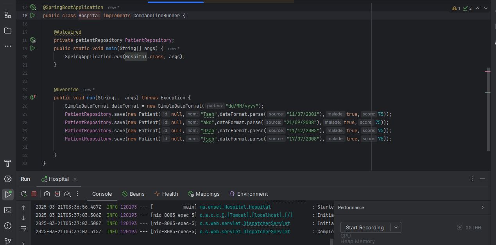
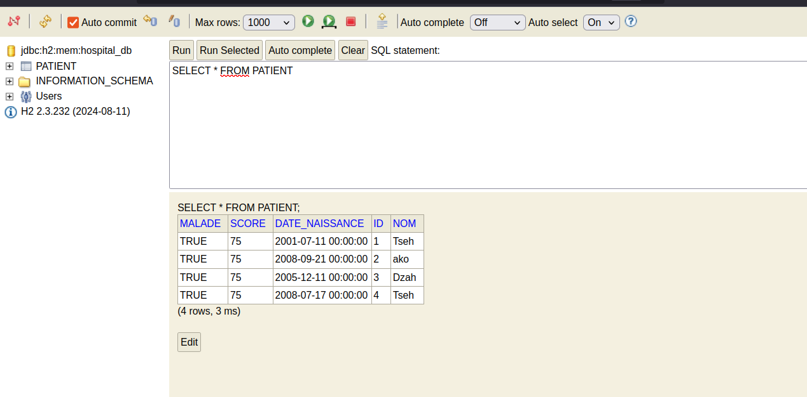

De la meme facon, nous utilisons le meme objet pour  consulter tous les patient en utilisant 
 la methode findAll:
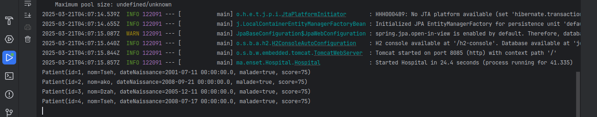
 nous avons aussi la consultation de patient par id
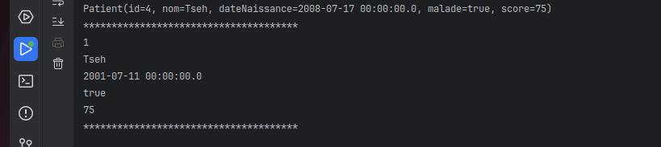

 Nous executons l'option recherche  par nom :
 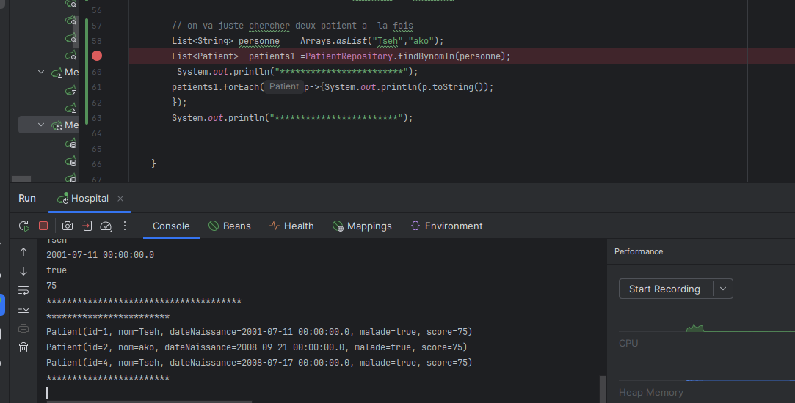

Nous faison la mise a jour du premier patient , nous 
allons changer le nom " tseh" "KokcaptureDEcran/test71.png)
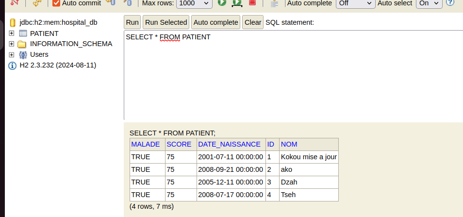


Nous allons supprimer la ligne que nous venons de mettre a jour
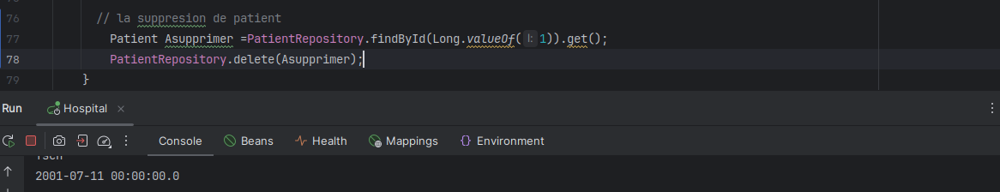
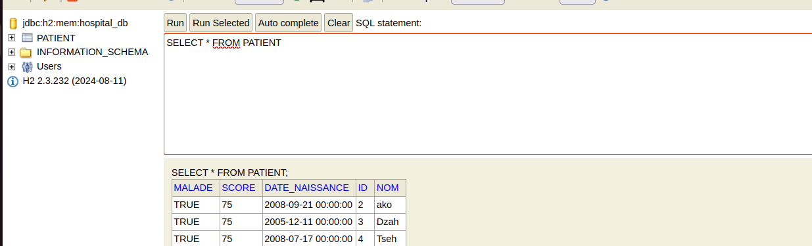

### Migrer de H2 Database vers MySQL
 Pour effectuer cela , nous devons  installer la base de donnee MySQL en local. Dans le cadre de ce TP ,
j'ai installer MySQL  via un conteneur docker . J'ai aussi installer phpmyadmin pour avoir jne intarface administrateur 
via le naviagateur. les differences configurations des conteneurs se trouvent dans le fichier [fichier docker compose ](docker-compose.yml)
L'executions de la commande ```docker-compose up -d``` permet de  creer les conteneurs. on ajoute ensuite les dependences du driver MySQL dans 
le fichier pom.xml et on modifie  le fichier ```application.properties``` pour se connecter a la base de donnee de MySQL : 
  l'Execution donne le code  le resultat suivant: 

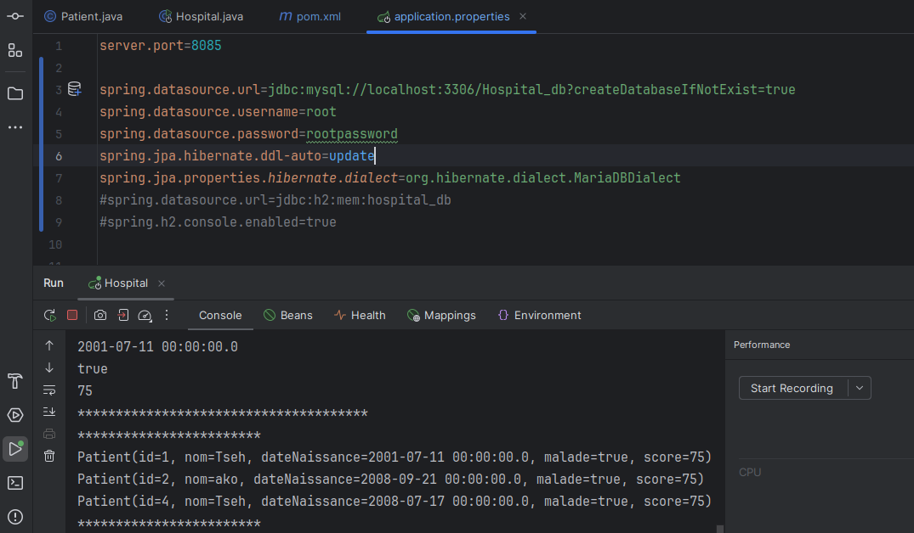
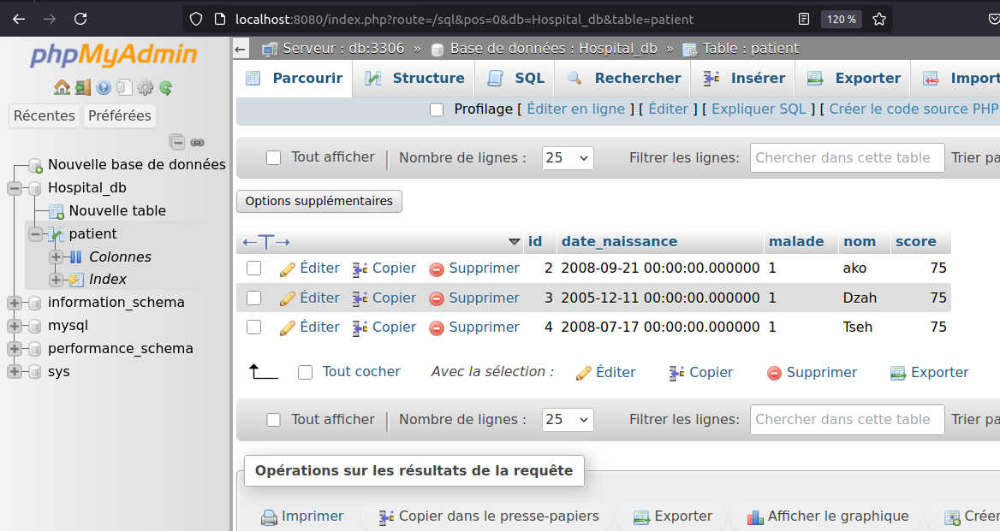


